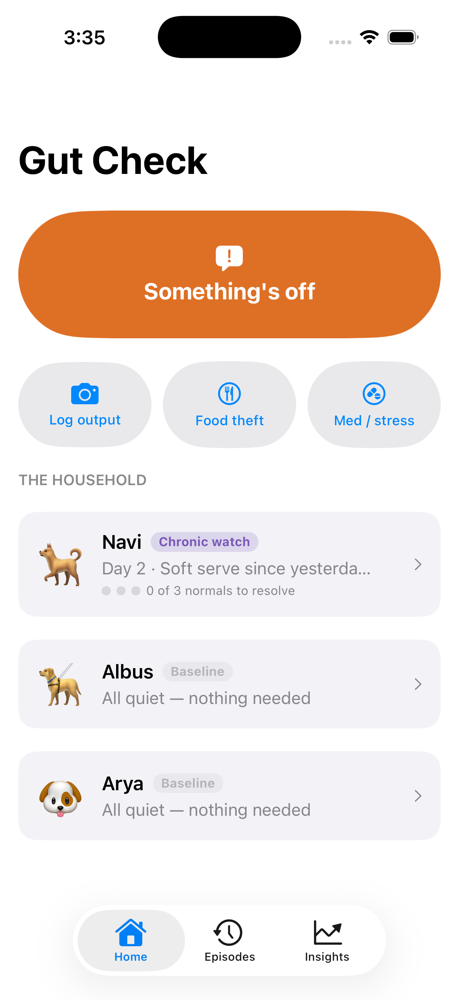
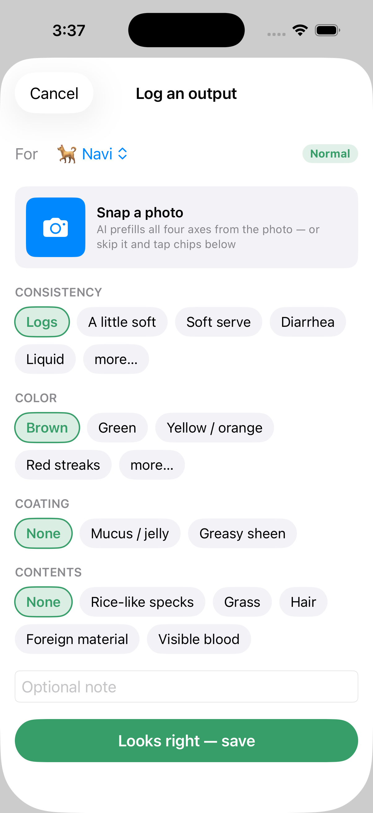
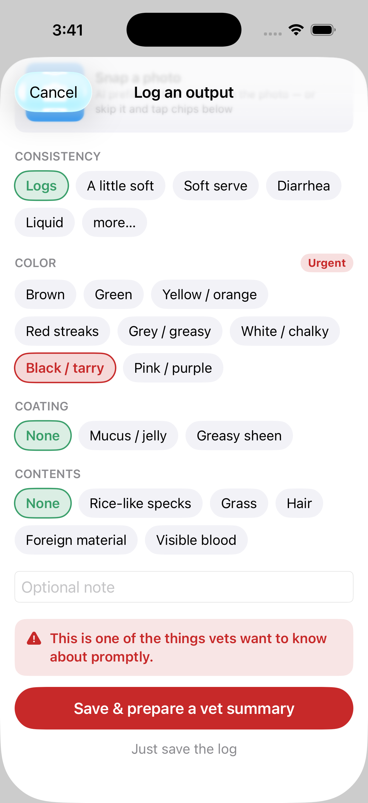
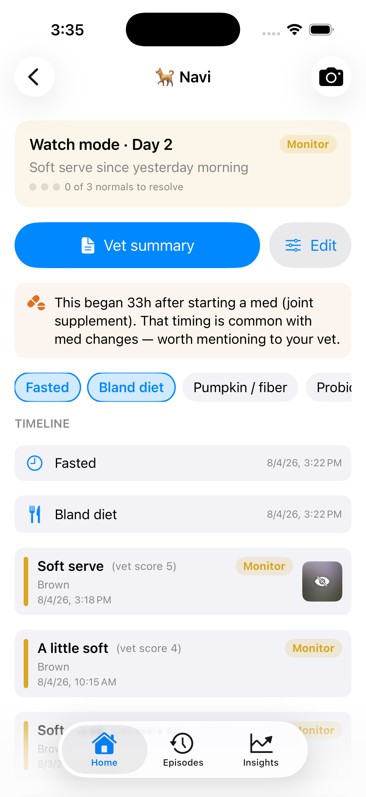
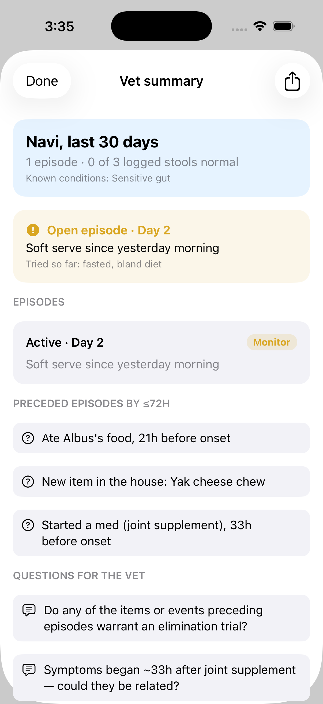
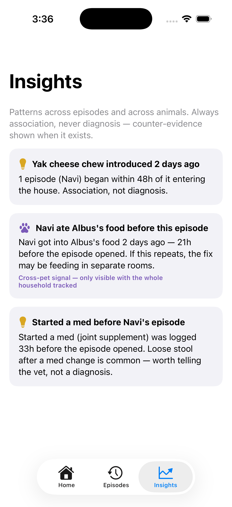

# Gut Check

**The health record for a house full of animals.** A native SwiftUI iOS app, built from [a full PRD](docs/PRD.md) — the product thinking came first, the code implements it.

When an animal gets sick, its owner becomes an amateur epidemiologist overnight — tracing outputs back to inputs entirely from memory. Memory fails in predictable ways (stool lags intake by 12–36h; nobody records what "normal" looked like; last episode's fix is forgotten by the next one). Gut Check is the instrument: episode-based tracking across a multi-pet household, camera-first capture, and a vet-legible summary on demand.

## Screens

| Home | Capture (4C) | Urgent breaks the layout |
|---|---|---|
|  |  |  |

| Pet timeline | Vet summary | Cross-pet insights |
|---|---|---|
|  |  |  |

## Product decisions worth noticing

- **Episodes, not daily logs.** The central object is a bounded period of abnormality (baseline → watch → 3 consecutive normals → resolution). Healthy animals cost the user nothing; there is no streak to abandon.
- **The 4Cs.** Consistency, Color, Coating, Contents as four independent axes — a perfectly formed stool can still be black and tarry. Owners tap a five-point plain-language scale ("soft serve"); the vet-standard 1–7 value is stored underneath.
- **Urgent findings break the layout.** One-tap muscle memory is the point of capture — so when an axis hits the Urgent tier, the vet action becomes the primary button and plain save demotes to a text link.
- **Multi-pet is the wedge.** Different diets under one roof make the household a natural control group; cross-feeding ("who ate whose food") is a first-class event no single-pet app can represent.
- **Attribution handled honestly.** Protocols are recorded as bundles, narrowed across episodes by intersection, always framed as association — with counter-evidence shown. The app never diagnoses.
- **Playfulness lives in the language, not the icons.** "Soft serve" is a label, not a 🍦. Nothing cute appears past the Monitor tier, and poop photos are blurred until deliberately tapped.

## What's implemented

Household home with per-pet status · 4C capture with photo attach (system picker; AI scoring stubbed as prefill-and-correct) · four-tier triage ladder with liquid-frequency escalation · episode state machine with chronic pinning · one-tap interventions, protocol capture and replay · 48-hour lookback · cross-feeding and med/stress exposure events · association-only insights with counter-evidence · unified per-pet timeline · pet editing · shareable vet summary (30-day headline, suspected triggers ≤72h before onset, flag log, questions-for-the-vet).

**Not yet:** real AI photo scoring, PDF export, onboarding flow, household invites / second-opinion loop.

## Build & run

Requires Xcode with the iOS platform installed.

```bash
brew install xcodegen   # once
xcodegen generate
open GutCheck.xcodeproj
```

No dependencies — plain SwiftUI, iOS 16.4+, JSON persistence. The project file is generated from `project.yml`; domain logic (triage tiers, resolution counting) is UI-free in `GutCheck/Domain.swift` and unit-checked with the CLI toolchain alone.

## Provenance

Spec'd in [PRD v0.3](docs/PRD.md) (problem → target user → core model → workflows → success metrics → risks), then built and iterated in-simulator with [Claude Code](https://claude.com/claude-code). PRD and product direction by Meagan Glenn.
